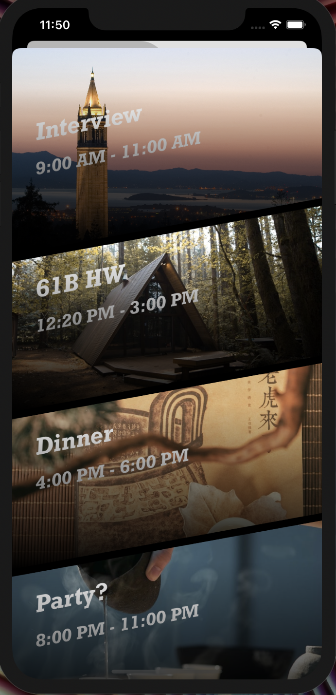

# Productime
Productime is an IOS app to help people schedule their daily tasks and improve personal time management ability. Based on Pomodoro Techniques, the app turn the monotonous work/break intervals switch to the seamless alternation of day and night with the indication of sunrise and sunset to offer best user experience.

- With the differnt built-in music (including clock tick, piano music, natural sounds and etc), you can always find fully immersed experience and feeling to work.
- Support set up new time and event in the beatiful task list with your personally picked background images. The sunset and sunrise and automatically be initiated based on your latest task and local time.
- Sychronize events with daily Google Calendar, feel free to use it for pomodoro time managment purpose only.
- Snapgram page that allows people to post a snap with pictures and share feelings

## Demo and Main User Interface
Note: for the demo purpose, the time and animation for each work interval is only 15 seconds (Real one should be 25 minutes).
  

    
    
 
